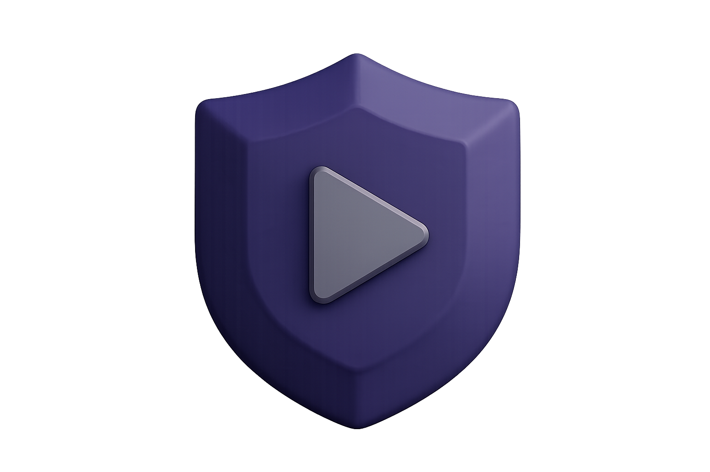
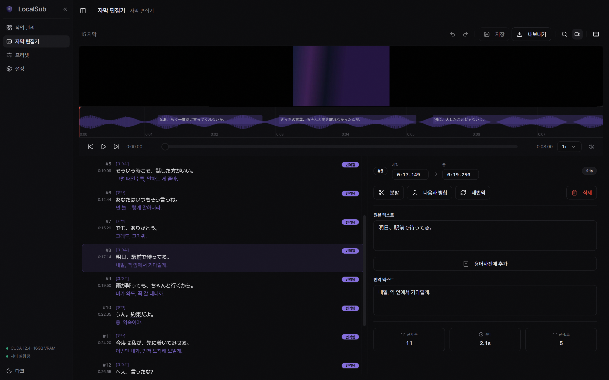
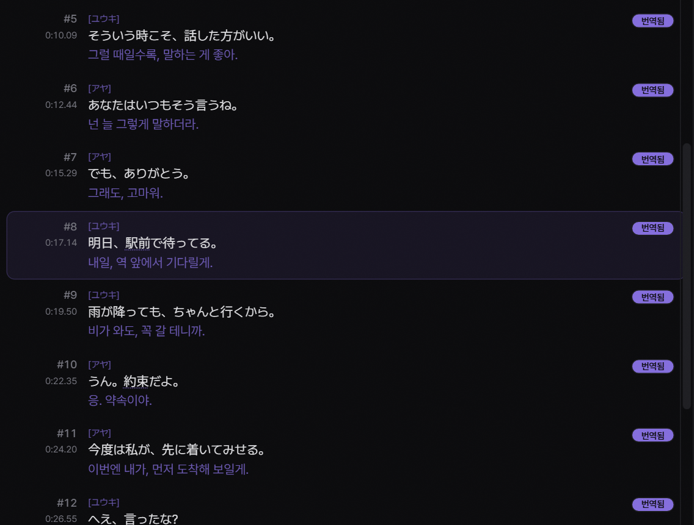
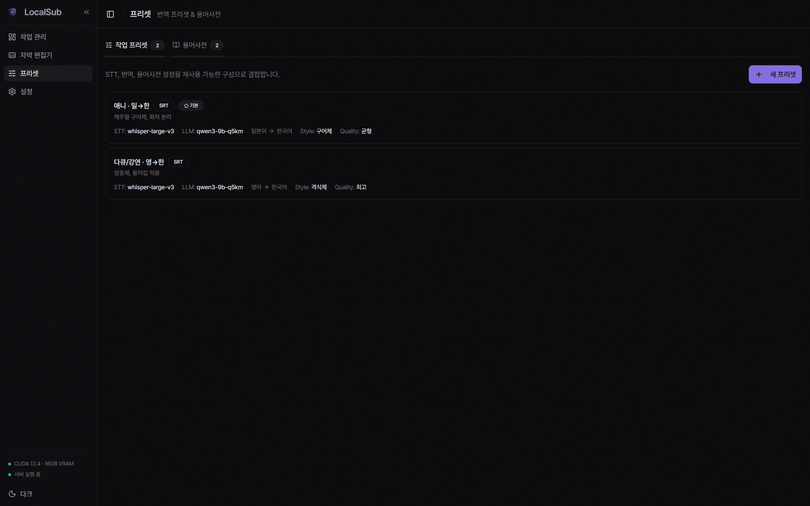
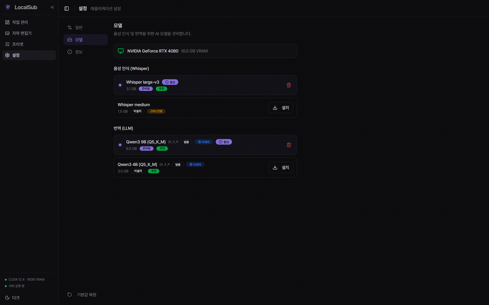
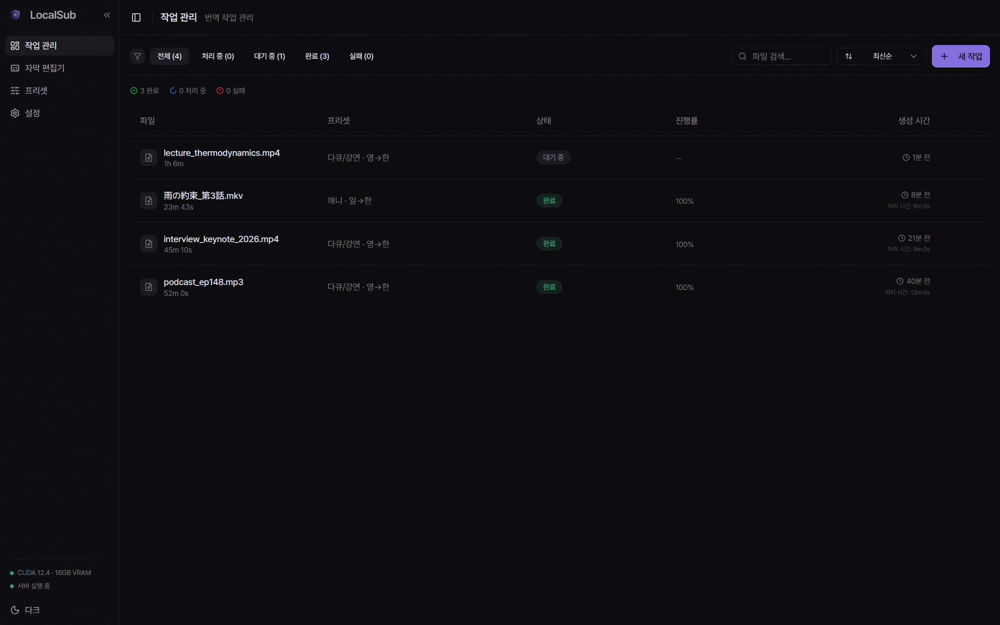

<p align="center">
  
</p>

<h1 align="center">LocalSub</h1>

<p align="center">
  <strong>내 영상. 내 언어. 내 컴퓨터.</strong><br/>
  <sub>클라우드 없이, 구독 없이 — 온전히 내 PC에서 돌아가는 AI 자막 생성·번역 앱.</sub>
</p>

<p align="center">
  
  
  
</p>

<p align="center">
  <a href="README.md">English</a> · <strong>한국어</strong>
</p>

<p align="center">
  
</p>

영상을 던지고 프리셋을 고르면 번역된 자막이 나옵니다. Whisper가 받아쓰고, 로컬 LLM이 번역하고, 내장 편집기에서 다듬습니다 — 전부 내 하드웨어에서. 영상·음성·자막은 어디로도 전송되지 않으며, 네트워크를 쓰는 건 모델 다운로드와 업데이트 확인뿐입니다.

## 다운로드

첫 Windows 릴리스를 마무리하는 중입니다. 그때까지는 [소스에서 빌드](#개발)할 수 있습니다.

## 기능

### 화자를 구분하는 음성 인식

faster-whisper(CTranslate2)가 CUDA 또는 CPU에서 로컬로 받아씁니다. 7개 언어 자동 감지, 그리고 누가 말했는지 라벨을 붙이는 화자 분리 — 인터뷰나 대화가 많은 영상에서 진가를 발휘합니다.

<p align="center">
  
</p>

### 번역 프리셋과 용어사전

언어 쌍·번역 스타일·용어사전을 한 번 저장하면 작업마다 재사용합니다. 용어사전은 인명·지명·전문 용어를 고정해, 모델이 매번 같은 표기로 번역하게 만듭니다.

<p align="center">
  
</p>

### 내장 자막 편집기

파형 내비게이션, 분할/병합, 타임 시프트, 찾기·바꾸기, 라인별 재번역. 품질 게이트에 걸린 라인은 하이라이트되어 모델이 어디서 흔들렸는지 바로 보이고, 일괄 재번역할 수 있습니다.

### 모델 관리

앱 안에서 Whisper와 LLM 모델을 탐색·다운로드·교체합니다. 모든 다운로드는 사용 전에 SHA-256으로 검증됩니다. 하드웨어 프로필(Lite / Balanced / Power)이 내 GPU에 맞는 모델을 추천합니다.

<p align="center">
  
</p>

### 체크포인트가 있는 일괄 처리

여러 파일을 큐에 넣고 돌립니다. 중단된 번역은 처음부터가 아니라 체크포인트에서 이어지고, 기존 SRT/VTT를 불러와 번역만 돌릴 수도 있습니다.

<p align="center">
  
</p>

## 동작 방식

1. **받아쓰기** — Whisper가 음성을 타임스탬프 달린 세그먼트로 변환합니다. 60분이 넘는 미디어는 30분 단위로 잘라 처리합니다.
2. **GPU 넘겨주기** — 단계 사이에 추론 서버를 재시작해 Whisper가 쓰던 VRAM을 LLM에 넘깁니다.
3. **번역** — LLM이 세그먼트 단위로 번역하며, rolling summary로 맥락을 유지합니다. 각 라인은 품질 게이트(스크립트 누출·엉뚱한 언어·폭주 반복·의미적 거부 탐지)를 통과해야 하고, 걸리면 재시도 후 플래그됩니다.
4. **편집·내보내기** — 편집기에서 다듬고 SRT·VTT·ASS·TXT로 내보냅니다. 이중 자막도 지원합니다.

## 시스템 요구 사항

| | 최소 | 권장 |
|---|---|---|
| **OS** | Windows 10 (64-bit) | Windows 11 |
| **RAM** | 8 GB | 16 GB+ |
| **디스크** | 4 GB 여유 | 10 GB+ |
| **GPU** | 없어도 됨 (CPU 모드) | NVIDIA 4 GB+ VRAM |

GPU가 없어도 CPU만으로 동작합니다. 있으면 확실히 빠릅니다. macOS · Linux는 확장 예정입니다.

<details>
<summary><strong>지원 형식 · 언어</strong></summary>

### 입력

| 영상 | 음성 |
|---|---|
| MP4 · MKV · AVI · MOV · WebM | MP3 · WAV · M4A · FLAC |

### 출력

| 형식 | |
|---|---|
| **SRT** | 가장 널리 쓰이는 자막 형식 |
| **VTT** | 웹 플레이어 호환 |
| **ASS** | 스타일 지정 가능 |
| **TXT** | 텍스트만 추출 |

모든 형식에서 원문+번역 이중 자막 내보내기를 지원합니다.

### 음성 인식 언어

자동 감지, English, 한국어, 日本語, 中文, Español, Français, Deutsch.

### 번역

위 언어 간 양방향, 4가지 스타일(직역·자연스러운·구어체·격식체). 앱 UI는 한국어·English·日本語·简体中文·Español을 지원합니다.

</details>

## 개발

준비물: Node.js 18+, Rust 1.70+, Python 3.10+, GPU 빌드는 CUDA toolkit.
Windows에서는 Visual Studio Build Tools(MSVC)와 Windows SDK도 필요합니다.

```bash
npm install
pip install -r python-server/requirements.txt

# llama-cpp-python: prebuilt 휠만 사용 — 소스 빌드 금지
pip install llama-cpp-python==0.3.28 --only-binary llama-cpp-python \
  --extra-index-url https://abetlen.github.io/llama-cpp-python/whl/cu124

# 최초 1회: 번들 Python 런타임을 src-tauri/resources/ 로 가져옵니다
powershell -ExecutionPolicy Bypass -File scripts/download-python-embed.ps1

npm run tauri dev
```

### 번들 리소스 (모든 Rust 빌드의 선행 조건)

`scripts/download-python-embed.ps1`이 `src-tauri/resources/`에 임베더블 CPython 런타임,
`get-pip.py`, 그리고 `python-server/` 사본을 채웁니다. 이들은 소스가 아니라 업스트림에서
받아오는 빌드 입력이라 `.gitignore` 대상이며, 갓 클론한 저장소에는 없습니다.

한 번만 실행하면 됩니다. 실행하지 않으면 `cargo test`, `npm run tauri dev`,
`npm run tauri build` 등 **모든** Rust 빌드가 번들 리소스를 평가하다 실패합니다:

```
glob pattern resources/python-server/* path not found or didn't match any files.
```

Windows에서는 cargo가 `link.exe`와 SDK 라이브러리를 찾을 수 있도록,
`vcvarsall.bat`으로 초기화된 셸에서 Rust 빌드를 실행하세요.

테스트:

```bash
npm test                                   # 프론트엔드 (vitest)
cd src-tauri && cargo test --lib           # Rust
cd python-server && python -m pytest -q .  # Python (경로 인자 "." 필수)
```

아키텍처와 개발 규약은 [CLAUDE.md](CLAUDE.md)를 참조하세요.

## 라이선스

**[PolyForm Noncommercial 1.0.0](LICENSE)** — 비상업 목적(개인 사용·학습·연구·비영리)이라면 자유롭게 사용·수정·공유할 수 있습니다. 상업적 사용은 별도 라이선스가 필요합니다. 이슈로 문의하세요.

OSI 의미의 오픈소스가 아니라 source-available 라이선스입니다. 재배포 시 [LICENSE](LICENSE)의 `Required Notice:` 고지를 포함해야 합니다.

### 제3자 구성요소 — FFmpeg

LocalSub은 FFmpeg를 **포함해 배포하지 않습니다.** **첫 실행 셋업이 내려받습니다** — [gyan.dev](https://www.gyan.dev/ffmpeg/builds/)가 배포하는 공식 Windows 빌드를 [그쪽 GitHub 릴리스](https://github.com/GyanD/codexffmpeg/releases)에서 직접 받으며, `src-tauri/resources/integrity.json`에 고정된 SHA-256으로 검증합니다. 해당 빌드는 GPL v3이고 소스는 [FFmpeg 저장소](https://github.com/FFmpeg/FFmpeg)에 있습니다. 시스템 `PATH`에 FFmpeg가 있으면 그것을 쓰고 아무것도 받지 않습니다.

FFmpeg는 선택 사항입니다. 60분 미만 미디어는 faster-whisper가 직접 디코딩하고, 그보다 긴 파일은 길이 측정에 `ffprobe`가, 청크 분할에 `ffmpeg`가 필요합니다. 그래서 다운로드가 실패해도 셋업이 중단되지 않으며, 새 작업 다이얼로그에서 다시 설치할 수 있습니다.

### 제3자 구성요소 — Python 런타임

FFmpeg와 달리 설치 파일은 CPython을 **포함해 배포합니다.** [python.org](https://www.python.org/downloads/windows/)의 임베더블 배포판을 [PSF 라이선스](https://docs.python.org/3/license.html)로 재배포하며, 해당 `LICENSE.txt`도 함께 설치됩니다. `get-pip.py`와 그것이 설치하는 `pip`은 MIT 라이선스입니다. `llama-cpp-python` 휠(MIT) 역시 `integrity.json`을 통해 첫 실행 시 다운로드·SHA-256 검증됩니다.
