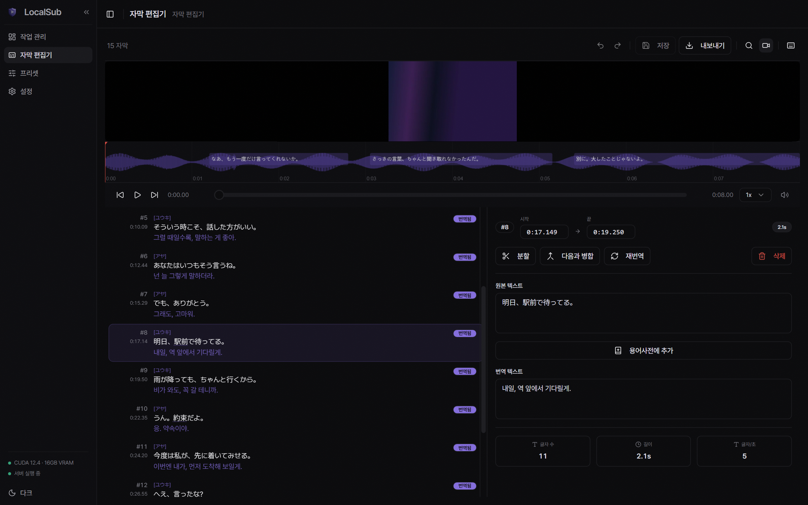
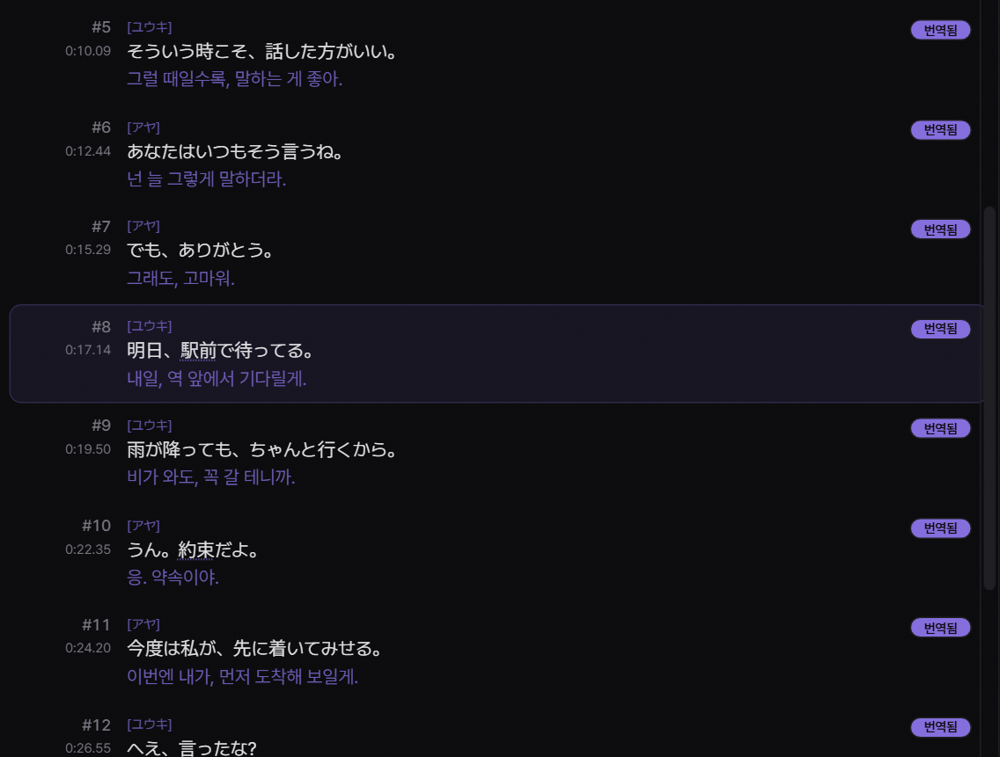
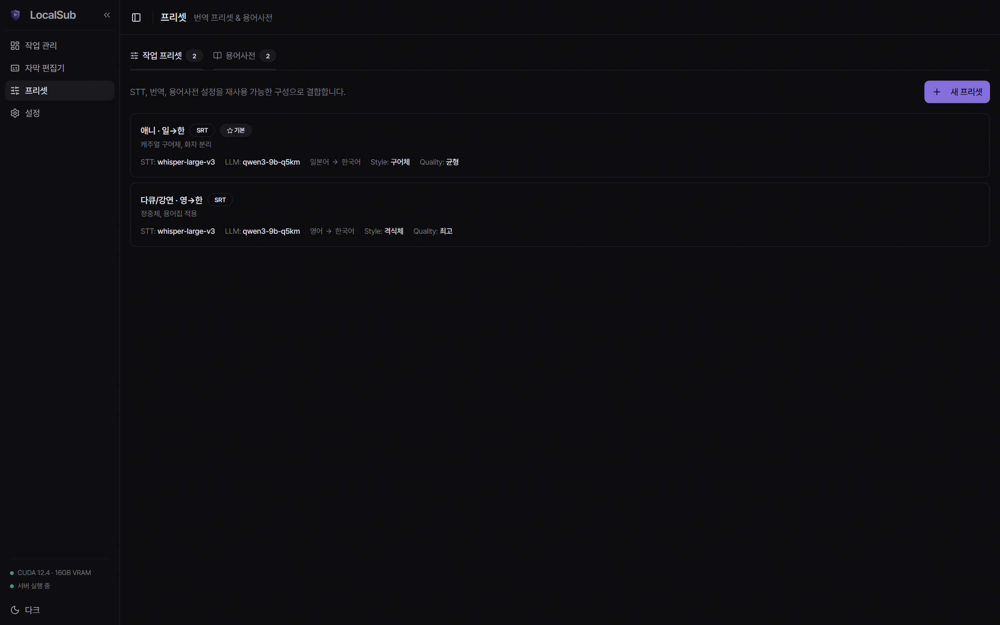
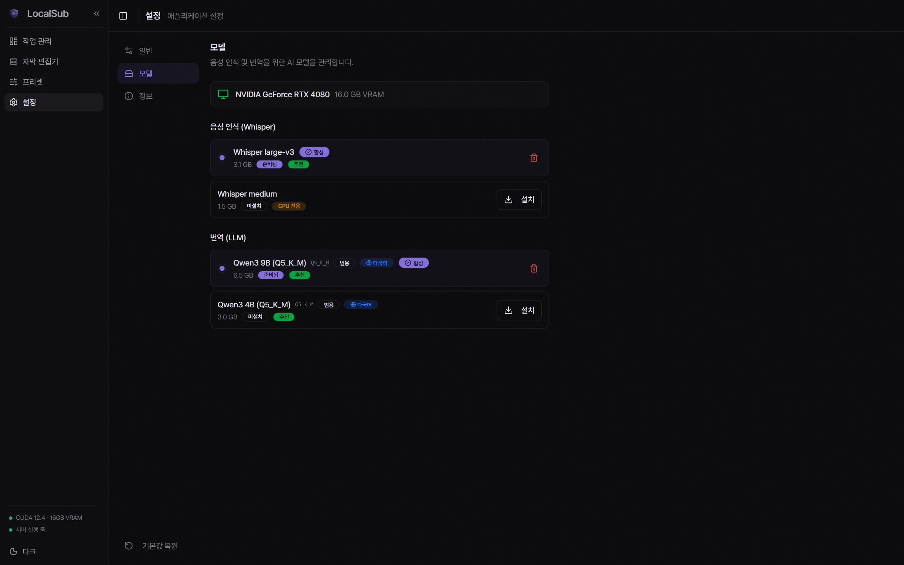
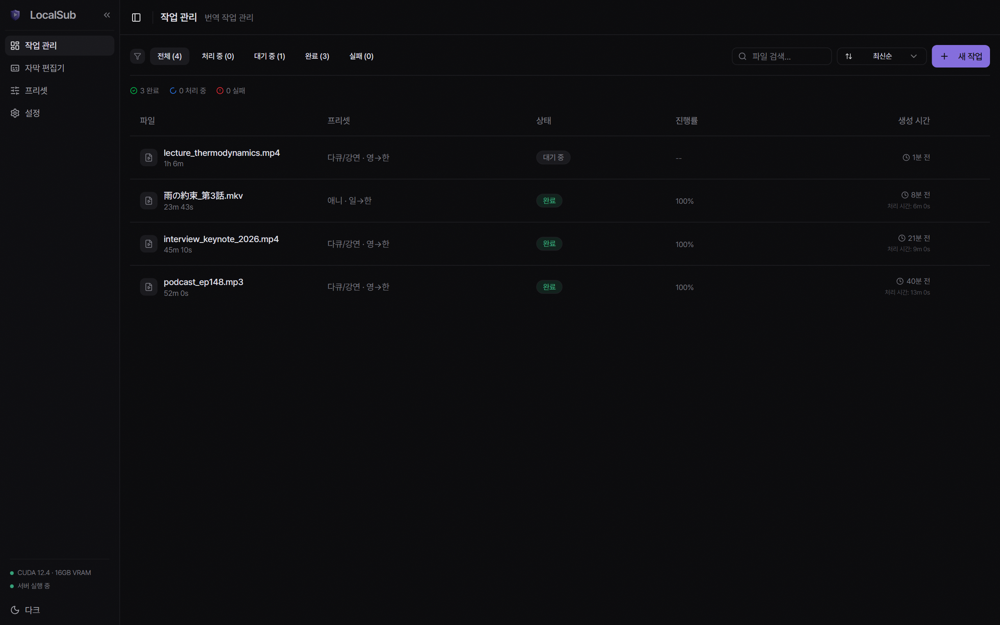

<p align="center">
  
</p>

<h1 align="center">LocalSub</h1>

<p align="center">
  <strong>완전 로컬 환경 기반 고성능 데스크톱 AI 자막 생성 및 신경망 기계번역 시스템</strong><br/>
  <sub>외부 클라우드 연동 및 구독 없이 로컬 하드웨어에서 전 공정을 독립 수행하는 온디바이스(On-Device) 엔지니어링 솔루션</sub>
</p>

<p align="center">
  
  
  
</p>

<p align="center">
  <a href="README.md">English</a> · <strong>한국어</strong>
</p>

<p align="center">
  
</p>

LocalSub은 미디어 파일 입력 및 번역 프리셋 설정을 기반으로 자막 생성부터 신경망 기계번역까지 단일 파이프라인으로 처리하는 독립 실행형 데스크톱 애플리케이션입니다. CTranslate2 기반 faster-whisper로 음성 인식을 수행하고, 양자화된 로컬 거대 언어 모델(LLM)을 통해 목표 언어로 번역하며, 통합 자막 에디터에서 정밀 후처리를 제공합니다. 입력 미디어, 음성 데이터 및 생성된 자막 텍스트는 외부 네트워크로 전송되지 않으며, 네트워크 트래픽은 모델 바이너리 다운로드 및 무결성 검증, 버전 업데이트 확인으로 엄격히 한정됩니다.

## 릴리스 및 다운로드

현재 Windows 정식 릴리스 빌드 패키징을 진행 중입니다. 공식 바이너리 배포 전까지는 [소스 코드를 통한 빌드](#개발-환경-구축-및-빌드) 절차를 통해 직접 실행할 수 있습니다.

## 주요 엔지니어링 기능

### 음성 인식 및 화자 분리 (STT & Diarization)

faster-whisper(CTranslate2) 엔진을 통하여 CUDA GPU 가속 또는 CPU 환경에서 로컬 음성 인식을 수행합니다. 7개 언어 자동 감지 및 Silero VAD 기반 음성 활동 감지를 기본 지원하며, ONNX Runtime 임베딩 추출과 scikit-learn 응집 군집화(Agglomerative Clustering) 알고리즘을 결합한 화자 분리(Diarization)를 통해 발화자별 세그먼트 라벨을 부여합니다.

<p align="center">
  
</p>

### 번역 프리셋 및 도메인 용어집 (Presets & Vocabulary)

언어 쌍(Source/Target), 번역 스타일(직역, 자연스러운 표현, 구어체, 격식체), 용어집(Vocabulary) 설정을 프리셋 단위로 영속화하여 반복 작업에 적용합니다. 용어집 제약 조건을 통해 고유명사, 기술 용어, 인명/지명의 표기를 강제 고정함으로써 번역 일관성을 보장합니다.

<p align="center">
  
</p>

### 통합 자막 편집기 (Integrated Subtitle Editor)

오디오 파형(Waveform) 시각화 내비게이션, 세그먼트 분할 및 병합, 타임코드 시프트, 전역 검색/치환, 라인 단위 재번역 기능을 제공합니다. 품질 게이트를 통과하지 못한 세그먼트는 시각적으로 하이라이트 처리되어 번역 이상 항목을 즉시 검토하고 일괄 재번역할 수 있습니다.

### 모델 수명주기 및 리소스 관리 (Model Lifecycle Management)

애플리케이션 인터페이스 내에서 Whisper 및 LLM 가중치 모델을 탐색, 다운로드, 검증 및 교체 관리합니다. 모든 모델 파일은 인출 즉시 SHA-256 암호학적 해시 검증을 거칩니다. 하드웨어 진단 모듈이 시스템 리소스를 분석하여 최적의 하드웨어 프로파일(Lite / Balanced / Power)을 자동 권장합니다.

<p align="center">
  
</p>

### 체크포인트 기반 일괄 배치 처리 (Fault-Tolerant Batch Processing)

다중 미디어 파일을 큐에 등록하여 순차적 일괄 처리를 수행합니다. 예기치 않은 중단 발생 시에도 체크포인트 영속화 메커니즘을 통해 미처리 세그먼트부터 안전하게 작업을 재개할 수 있으며, 기존 SRT/VTT 파일을 로드하여 독립 번역 파이프라인만 수행하는 것도 가능합니다.

<p align="center">
  
</p>

## 파이프라인 아키텍처 및 동작 원리

LocalSub의 자막 처리 파이프라인은 리소스 격리와 단계별 무결성 검증을 중심으로 동작합니다:

1. **음성 인식 및 세그먼트 생성 (STT & VAD)**: faster-whisper 엔진이 오디오 스트림을 분석하여 타임스탬프가 결합된 텍스트 세그먼트를 생성합니다. 60분 초과 미디어 파일은 FFmpeg를 통해 30분 단위 오디오 청크로 자동 분할되어 메모리 오버플로우를 방지합니다.
2. **비디오 메모리 재할당 핸드오버 (VRAM Reallocation Handover)**: Whisper 추론 완료 후 단계 전환 시 Python 추론 서버 프로세스를 정상 재시작하여 점유되었던 VRAM을 100% 회수하고, LLM 번역 엔진에 비디오 메모리를 재할당합니다.
3. **신경망 기계번역 및 롤링 요약 (NMT with Rolling Summary)**: llama-cpp-python을 통해 세그먼트 단위로 번역을 수행하며, 25개 세그먼트 단위의 롤링 요약을 프롬프트에 주입하여 장기 문맥 일관성을 유지합니다.
4. **다단계 품질 게이트 검증 (Multi-Stage Quality Gate)**: 각 세그먼트는 모델 무관 구조적 필터(스크립트 누출, 언어 불일치, 퇴행적 반복 탐지) 및 의미론적 거부 감지 게이트(Embedding Gate)를 거칩니다. 불량 출력 검출 시 높은 Temperature 조건으로 1회 자동 재시도 후 이상 플래그를 기록합니다.
5. **편집 및 다중 포맷 내보내기 (Export & Dual Subtitles)**: 내장 에디터 검토 후 SRT, VTT, ASS, TXT 포맷으로 변환 내보내기를 수행하며, 원문과 번역문이 결합된 이중 언어 자막 출력을 완벽히 지원합니다.

> 시스템 아키텍처 및 세부 설계는 [SPEC.md](docs/specs/SPEC.md), 아키텍처 다이어그램은 [docs/diagrams/](docs/diagrams/), 표준 기술 용어는 [docs/glossary.md](docs/glossary.md)를 참조하십시오.

## 시스템 요구 사양

| 구성요소 | 최소 사양 | 권장 사양 |
|---|---|---|
| **운영체제 (OS)** | Windows 10 (64-bit) | Windows 11 (64-bit) |
| **시스템 메모리 (RAM)** | 8 GB | 16 GB 이상 |
| **스토리지 디스크** | 4 GB 가용 공간 | 10 GB 이상 가용 공간 |
| **그래픽 프로세서 (GPU)** | 미요구 (CPU 모드 동작) | NVIDIA GPU (VRAM 4 GB 이상) |

시스템에 외장 GPU가 부재한 경우에도 CPU 모드를 통해 전 기능이 정상 동작하며, CUDA 호환 GPU 장착 시 비약적인 추론 속도 향상을 제공합니다. (macOS 및 Linux 환경은 향후 지원 예정입니다.)

<details>
<summary><strong>입출력 지원 규격 및 대상 언어 명세</strong></summary>

### 입력 지원 미디어 포맷

| 비디오 포맷 | 오디오 포맷 |
|---|---|
| MP4 · MKV · AVI · MOV · WebM | MP3 · WAV · M4A · FLAC |

### 출력 지원 자막 포맷

| 자막 포맷 | 기술적 특징 및 호환성 |
|---|---|
| **SRT** | 전 세계 표준 범용 자막 포맷 (SubRip Subtitle) |
| **VTT** | HTML5 웹 비디오 표준 호환 포맷 (WebVTT) |
| **ASS** | 스타일 및 폰트 레이아웃 지정 고급 자막 포맷 (Advanced SubStation Alpha) |
| **TXT** | 타임코드가 제외된 순수 텍스트 추출 포맷 |

모든 출력 포맷에서 원문과 번역문이 병기된 이중 언어 자막 생성을 지원합니다.

### 음성 인식 지원 언어

자동 감지(Auto-detect), English, 한국어, 日本語, 中文, Español, Français, Deutsch.

### 신경망 기계번역 지원 언어 및 스타일

상기 지원 언어 간 양방향 번역을 지원하며, 4종 번역 스타일(직역·자연스러운 표현·구어체·격식체)을 선택할 수 있습니다. 애플리케이션 UI는 한국어, English, 日本語, 简体中文, Español의 5개 국어를 지원합니다.

</details>

## 개발 환경 구축 및 빌드

사전 요구 조건: Node.js 18+, Rust 1.70+, Python 3.10+, GPU 빌드용 CUDA Toolkit.
Windows 환경에서는 Visual Studio Build Tools (MSVC 컴파일러 툴체인) 및 Windows SDK가 필수적으로 요구됩니다.

```bash
# 의존성 패키지 설치
npm install
pip install -r python-server/requirements.txt

# llama-cpp-python: 사전 컴파일된 바이너리 휠 설치 (소스 빌드 금지)
pip install llama-cpp-python==0.3.28 --only-binary llama-cpp-python \
  --extra-index-url https://abetlen.github.io/llama-cpp-python/whl/cu124

# 최초 1회: 번들 Python 런타임을 src-tauri/resources/ 경로로 다운로드 및 프로비저닝
powershell -ExecutionPolicy Bypass -File scripts/download-python-embed.ps1

# 개발 서버 실행
npm run tauri dev
```

### 번들 리소스 요구사항 (Rust 빌드 선행 조건)

`scripts/download-python-embed.ps1` 스크립트는 `src-tauri/resources/` 디렉토리에 임베디드 CPython 런타임, `get-pip.py`, 그리고 `python-server/` 구성요소를 배치합니다. 해당 리소스는 업스트림에서 인출되는 빌드 입력 자산이므로 `.gitignore`에 등록되어 있으며, 초기 클론 상태의 저장소에는 존재하지 않습니다.

최초 1회 실행이 필수적이며, 리소스가 구성되지 않은 상태에서는 `cargo test`, `npm run tauri dev`, `npm run tauri build`를 포함한 모든 Rust 컴파일 과정이 리소스 글로브 패턴 평가 단계에서 중단됩니다:

```
glob pattern resources/python-server/* path not found or didn't match any files.
```

Windows 환경에서는 Cargo가 MSVC `link.exe` 링커 및 Windows SDK 라이브러리를 올바르게 인식할 수 있도록 `vcvarsall.bat`으로 초기화된 셸 세션에서 빌드를 실행해야 합니다.

### 단위 및 통합 테스트 실행

```bash
# 프론트엔드 단위 테스트 (Vitest)
npm test

# 데스크톱 네이티브 백엔드 단위 테스트 (Rust)
cd src-tauri && cargo test --lib

# AI 추론 서버 단위 테스트 (Pytest, 경로 '.' 인자 필수)
cd python-server && python -m pytest -q .
```

아키텍처 세부 명세와 개발 규약에 관한 상세 내용은 [CLAUDE.md](CLAUDE.md) 및 [docs/glossary.md](docs/glossary.md)를 참조하십시오.

## 소프트웨어 라이선스

**[PolyForm Noncommercial 1.0.0](LICENSE)** — 비상업적 용도(개인 사용, 학술 연구, 교육, 비영리 활동)에 한하여 소스 코드의 이용, 수정 및 재배포가 자유롭게 보장됩니다. 상업적 목적의 활용은 별도의 라이선스 계약이 체결되어야 하므로 저장소 이슈를 통해 문의하시기 바랍니다.

본 소프트웨어는 OSI(Open Source Initiative) 정의의 전통적 오픈소스가 아닌 소스 공개(Source-Available) 라이선스를 따릅니다. 재배포 시 [LICENSE](LICENSE) 파일의 `Required Notice:` 고지 조항을 반드시 포함해야 합니다.

### 외부 구성요소 라이선스 — FFmpeg

LocalSub 배포 패키지는 FFmpeg 바이너리를 직접 포함하여 배포하지 않습니다. **애플리케이션 최초 실행 프로비저닝 단계에서 다운로드가 수행**되며, [gyan.dev](https://www.gyan.dev/ffmpeg/builds/)에서 배포하는 공식 Windows 빌드를 [공식 GitHub 릴리스 저장소](https://github.com/GyanD/codexffmpeg/releases)로부터 직접 인출하고, `src-tauri/resources/integrity.json`에 명시된 SHA-256 해시로 무결성을 검증합니다. 해당 빌드는 GPL v3 라이선스를 따르며 소스 코드는 [FFmpeg 공식 저장소](https://github.com/FFmpeg/FFmpeg)에서 획득할 수 있습니다. 운영체제 `PATH` 환경변수에 이미 FFmpeg가 등록되어 있는 경우 시스템 바이너리를 우선 활용하며 외부 인출을 생략합니다.

FFmpeg 구성요소는 선택적 의존성입니다. 60분 미만의 미디어는 faster-whisper가 직접 디코딩하며, 60분을 초과하는 미디어에 한하여 미디어 재생시간 계측(`ffprobe`) 및 청크 분할(`ffmpeg`)에 사용됩니다. 따라서 네트워크 장애 등으로 FFmpeg 다운로드가 실패하더라도 시스템 셋업 전체가 중단되지 않으며, 작업 다이얼로그를 통해 재설치를 수행할 수 있습니다.

### 외부 구성요소 라이선스 — Python 런타임

FFmpeg와 달리 최종 인스톨러 패키지는 CPython 임베디드 배포판을 직접 포함하여 배포합니다. [python.org](https://www.python.org/downloads/windows/)의 공식 임베디드 런타임을 [PSF 라이선스](https://docs.python.org/3/license.html) 조건에 따라 재배포하며, 해당 `LICENSE.txt`가 설치 디렉토리에 함께 동봉됩니다. 부트스트랩 스크립트 `get-pip.py` 및 이를 통해 설치되는 `pip` 패키지 관리자는 MIT 라이선스를 따릅니다. `llama-cpp-python` 사전 컴파일 휠(MIT) 역시 `integrity.json` 명세를 통해 최초 실행 시 검증 다운로드 및 설치가 완료됩니다.
