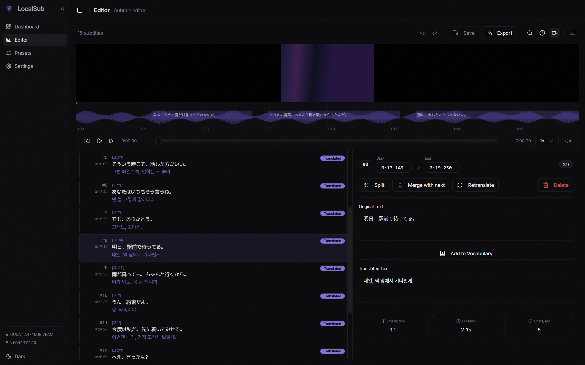
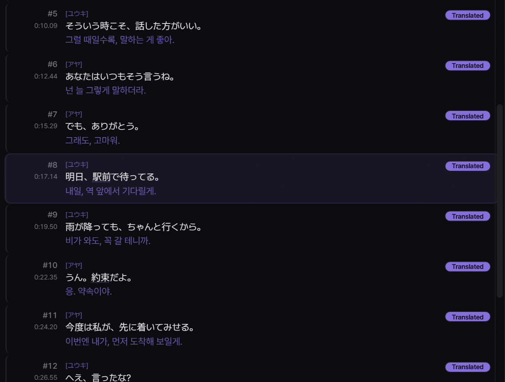
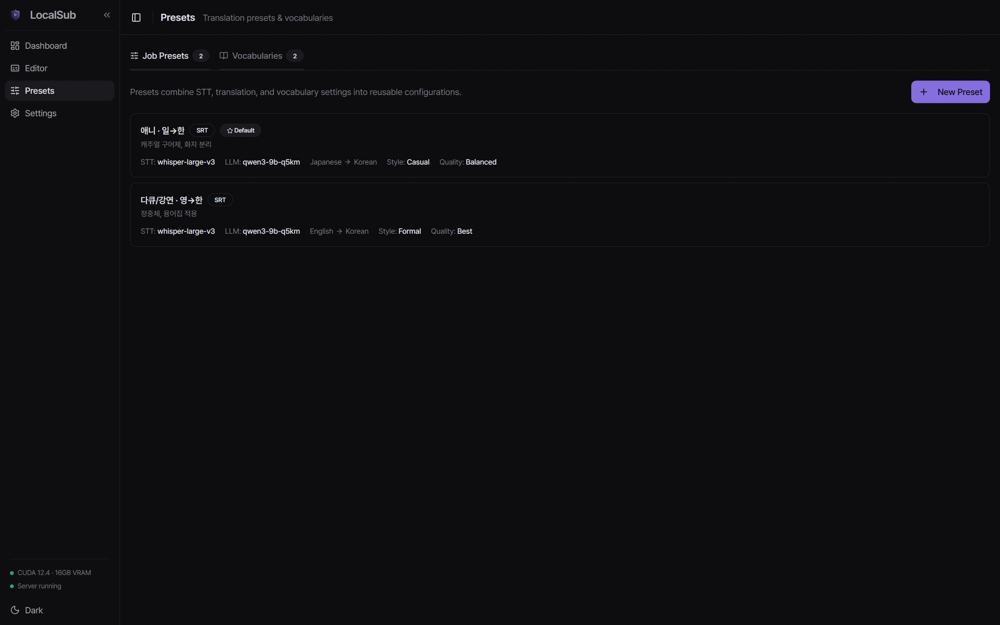
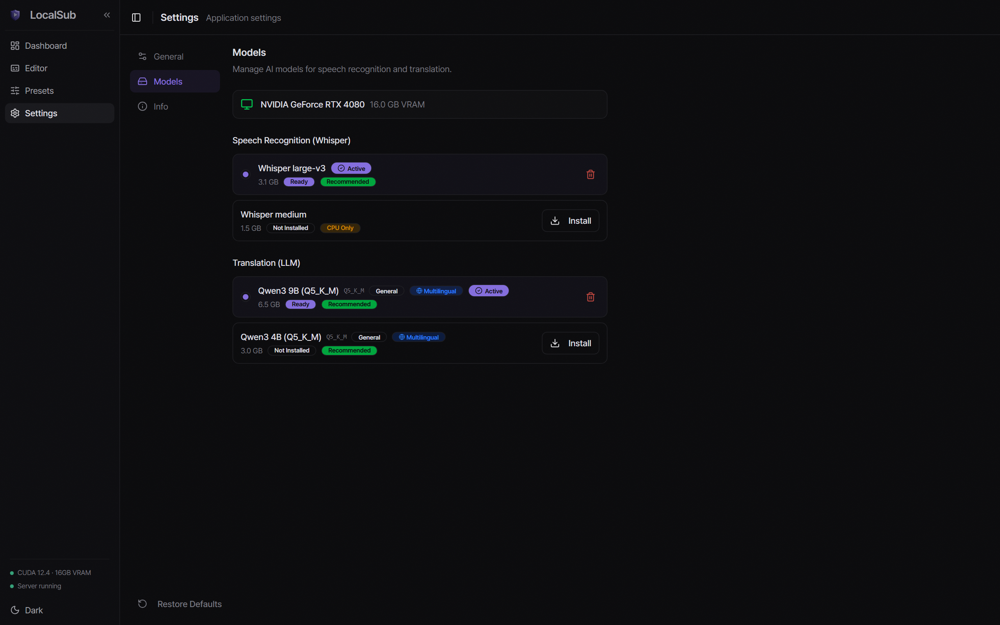
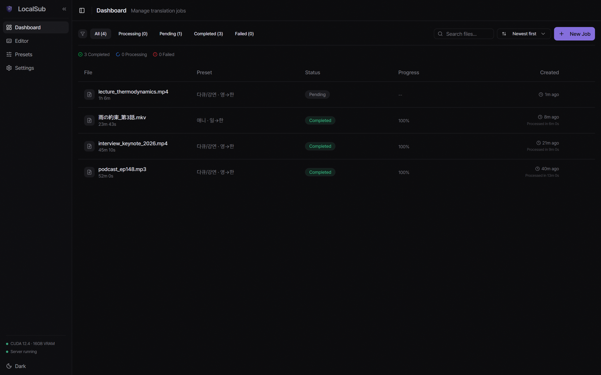

<p align="center">
  
</p>

<h1 align="center">LocalSub</h1>

<p align="center">
  <strong>Your video. Your language. Your machine.</strong><br/>
  <sub>AI subtitle generation and translation that runs entirely on your PC — no cloud, no subscription.</sub>
</p>

<p align="center">
  
  
  
</p>

<p align="center">
  <strong>English</strong> · <a href="README.ko.md">한국어</a>
</p>

<p align="center">
  
</p>

Drop in a video, pick a preset, and get translated subtitles. LocalSub transcribes with Whisper, translates with a local LLM, and lets you polish the result in a built-in editor — all of it on your own hardware. Your video, audio, and subtitles never leave your machine; the only network traffic is downloading models and checking for updates.

## Download

The first Windows release is being finalized. Until then, you can [build from source](#development).

## Features

### Speech recognition with speaker detection

faster-whisper (CTranslate2) transcribes locally on CUDA or CPU, with automatic language detection across 7 languages. Optional speaker diarization labels who said what — useful for interviews and dialogue-heavy footage.

<p align="center">
  
</p>

### Translation presets and glossaries

Save a language pair, translation style, and vocabulary once, then reuse them per job. Glossaries pin your terminology — character names, place names, domain terms — so the model translates them consistently every time.

<p align="center">
  
</p>

### Built-in subtitle editor

Waveform navigation, split/merge, time shifting, find & replace, and per-line retranslation. Lines the quality gate flagged are highlighted so you can review exactly where the model struggled — and retranslate them in bulk.

### Model management

Browse, download, and swap Whisper and LLM models from inside the app. Every download is pinned and verified by SHA-256 before it is used. A hardware profile (Lite / Balanced / Power) matches model choices to your GPU.

<p align="center">
  
</p>

### Batch processing with checkpoints

Queue multiple files and let them run. Interrupted translations resume from a checkpoint instead of starting over, and existing SRT/VTT files can be imported for translation-only runs.

<p align="center">
  
</p>

## How it works

1. **Transcribe** — Whisper converts speech to timestamped segments. Media over 60 minutes is processed in 30-minute chunks.
2. **Hand over the GPU** — the inference server restarts between stages so the LLM gets the VRAM Whisper was using.
3. **Translate** — the LLM translates segment by segment with a rolling summary for context. Each line passes a quality gate (script leakage, off-target language, runaway repetition, semantic refusal detection); failures are retried and flagged.
4. **Edit & export** — review in the editor, then export SRT, VTT, ASS, or TXT — including dual-language subtitles.

## System requirements

| | Minimum | Recommended |
|---|---|---|
| **OS** | Windows 10 (64-bit) | Windows 11 |
| **RAM** | 8 GB | 16 GB+ |
| **Disk** | 4 GB free | 10 GB+ |
| **GPU** | none (CPU mode) | NVIDIA, 4 GB+ VRAM |

LocalSub runs fine on CPU alone; a GPU makes it substantially faster. macOS and Linux are planned.

<details>
<summary><strong>Supported formats & languages</strong></summary>

### Input

| Video | Audio |
|---|---|
| MP4 · MKV · AVI · MOV · WebM | MP3 · WAV · M4A · FLAC |

### Output

| Format | |
|---|---|
| **SRT** | the most widely supported subtitle format |
| **VTT** | web player compatible |
| **ASS** | advanced styling |
| **TXT** | plain text export |

Dual-language export (original + translation together) is supported for all formats.

### Speech recognition languages

Auto-detect, English, 한국어, 日本語, 中文, Español, Français, Deutsch.

### Translation

Any pair of the above, in four styles: literal, natural, conversational, formal. The app UI itself is available in English, Korean, Japanese, Simplified Chinese, and Spanish.

</details>

## Development

Prerequisites: Node.js 18+, Rust 1.70+, Python 3.10+, and a CUDA toolkit for GPU builds.
On Windows you also need the Visual Studio Build Tools (MSVC) and a Windows SDK.

```bash
npm install
pip install -r python-server/requirements.txt

# llama-cpp-python: prebuilt wheel only — do not build from source
pip install llama-cpp-python==0.3.28 --only-binary llama-cpp-python \
  --extra-index-url https://abetlen.github.io/llama-cpp-python/whl/cu124

# One-time: fetch the bundled Python runtime into src-tauri/resources/
powershell -ExecutionPolicy Bypass -File scripts/download-python-embed.ps1

npm run tauri dev
```

### Bundled resources (required before any Rust build)

`scripts/download-python-embed.ps1` populates `src-tauri/resources/` with the embeddable
CPython runtime, `get-pip.py`, and a copy of `python-server/`. These are build inputs
fetched from upstream rather than source code, so they are `.gitignore`d and a fresh clone
does not have them.

Run the script once. Without it, **every** Rust build — `cargo test`, `npm run tauri dev`,
`npm run tauri build` — fails while evaluating the bundle resources:

```
glob pattern resources/python-server/* path not found or didn't match any files.
```

On Windows, run Rust builds from a shell initialized by `vcvarsall.bat` so cargo can find
`link.exe` and the SDK libraries.

Tests:

```bash
npm test                                   # frontend (vitest)
cd src-tauri && cargo test --lib           # Rust
cd python-server && python -m pytest -q .  # Python (the trailing "." matters)
```

See [CLAUDE.md](CLAUDE.md) for architecture notes and development conventions.

## License

**[PolyForm Noncommercial 1.0.0](LICENSE)** — free to use, modify, and share for noncommercial purposes (personal use, learning, research, nonprofits). Commercial use requires a separate license; open an issue to get in touch.

This is a source-available license, not OSI open source. Redistribution must include the `Required Notice:` from [LICENSE](LICENSE).

### Third-party components — FFmpeg

LocalSub does **not** bundle or distribute FFmpeg. **First-run setup downloads it** — the official Windows build published by [gyan.dev](https://www.gyan.dev/ffmpeg/builds/), fetched directly from [their GitHub releases](https://github.com/GyanD/codexffmpeg/releases), pinned and SHA-256-verified via `src-tauri/resources/integrity.json`. That build is licensed under the GPL v3; its source is available at the [FFmpeg repository](https://github.com/FFmpeg/FFmpeg). If FFmpeg is already on your `PATH`, LocalSub uses that and downloads nothing.

FFmpeg is optional. Media under 60 minutes is decoded by faster-whisper directly; longer files need `ffprobe` to measure their duration and `ffmpeg` to split them into chunks. A failed download therefore does not block setup, and the New Job dialog offers the install again.

### Third-party components — Python runtime

Unlike FFmpeg, the installer **does** bundle CPython. The embeddable distribution from [python.org](https://www.python.org/downloads/windows/) is redistributed under the [PSF License](https://docs.python.org/3/license.html), and its `LICENSE.txt` is installed alongside it. `get-pip.py` and the `pip` it bootstraps are MIT-licensed. The `llama-cpp-python` wheels (MIT) are downloaded and SHA-256-verified on first run, also via `integrity.json`.
