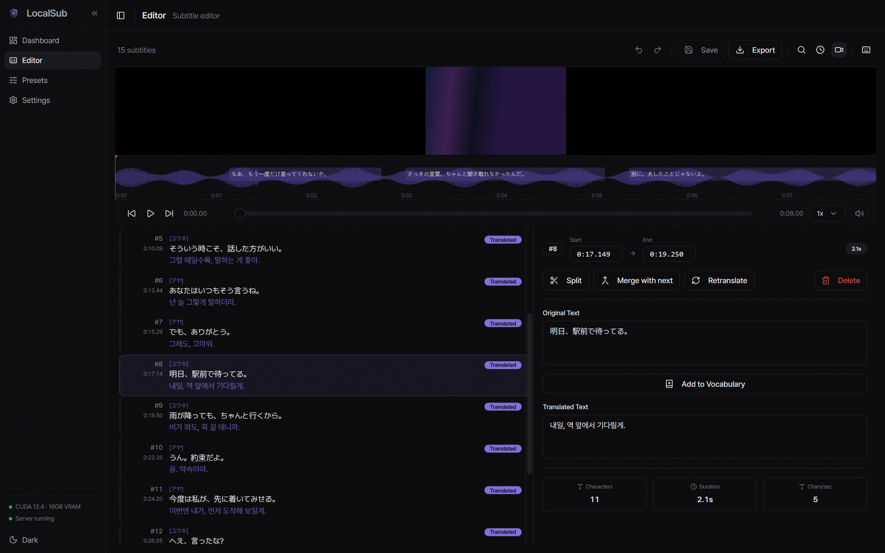
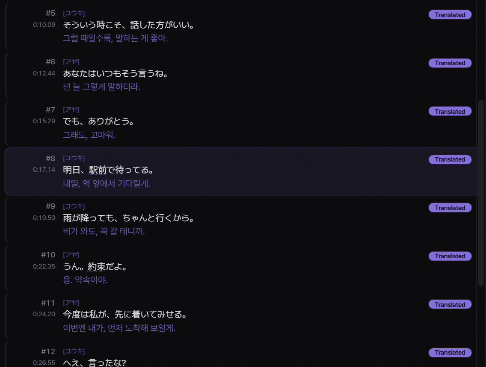
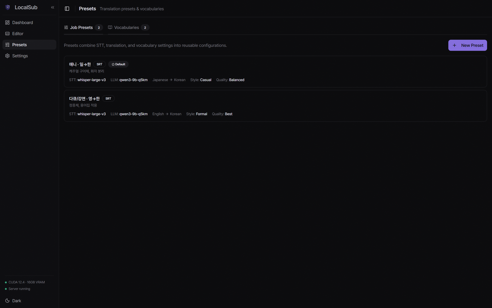
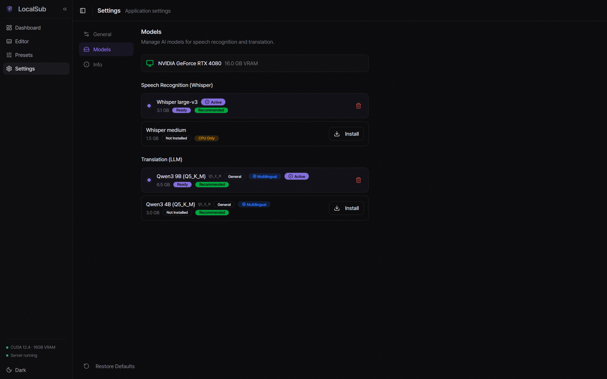
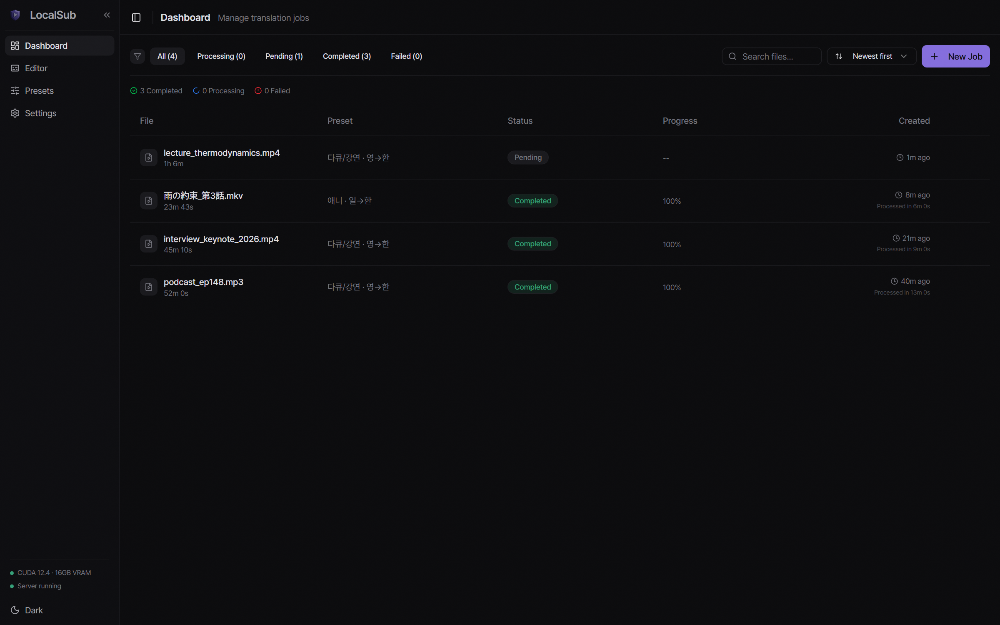

<p align="center">
  
</p>

<h1 align="center">LocalSub</h1>

<p align="center">
  <strong>On-Device Neural Subtitle Generation and Machine Translation System</strong><br/>
  <sub>A self-contained desktop solution operating entirely on local hardware without cloud dependencies or subscription tiers.</sub>
</p>

<p align="center">
  
  
  
</p>

<p align="center">
  <strong>English</strong> · <a href="README.ko.md">한국어</a>
</p>

<p align="center">
  
</p>

LocalSub is a standalone desktop application that processes media files through an end-to-end speech recognition and neural machine translation pipeline. It performs speech transcription using faster-whisper (CTranslate2), executes neural machine translation via quantized local Large Language Models (llama-cpp-python), and provides precision post-editing through an integrated subtitle editor. All processing is executed locally on user hardware. Media content, audio streams, and generated subtitles remain strictly confidential on the local machine; network communication is restricted exclusively to model downloads, cryptographic verification, and update checks.

## Download & Releases

Packaging for the official Windows release is currently underway. In the interim, the application can be compiled directly [from source](#development).

## Engineering Capabilities

### Speech Recognition & Speaker Diarization

Local speech transcription is powered by faster-whisper (CTranslate2) with support for CUDA GPU acceleration and CPU execution. The engine features automatic language identification across 7 languages and Silero VAD voice activity detection. An optional speaker diarization pipeline combines ONNX Runtime acoustic embedding extraction with scikit-learn agglomerative clustering to generate speaker-attributed subtitle segments.

<p align="center">
  
</p>

### Translation Presets & Domain Vocabulary

Language pairs (source/target), translation styles (literal, natural, conversational, formal), and domain vocabulary constraints can be persisted as reusable presets. Vocabulary constraints enforce exact terminology mapping for proper nouns, technical terms, and named entities across translation iterations.

<p align="center">
  
</p>

### Integrated Subtitle Editor

The built-in editor offers waveform-based visual navigation, segment splitting and merging, timecode shifting, global search and replace, and line-level retranslation. Subtitle lines flagged by the quality gate are visually highlighted for review, enabling targeted inspection and bulk retranslation.

### Model Lifecycle & Hardware Management

Whisper and LLM models can be discovered, downloaded, cryptographically verified, and managed directly within the user interface. Every model download is verified against SHA-256 checksums prior to activation. An automated hardware detection module analyzes system resources to recommend an optimal profile (Lite / Balanced / Power).

<p align="center">
  
</p>

### Fault-Tolerant Batch Processing

Multiple media files can be queued for sequential execution. In the event of process interruption, the checkpoint persistence mechanism resumes translation from the last uncommitted segment rather than restarting the batch. External SRT and VTT files can also be imported directly for translation-only execution.

<p align="center">
  
</p>

## Pipeline Architecture & Operational Flow

The processing pipeline isolates system resources and enforces stage-by-stage validation:

1. **Transcription & VAD** — faster-whisper extracts timestamped speech segments. Media exceeding 60 minutes is partitioned by FFmpeg into 30-minute audio chunks to prevent memory exhaustion.
2. **VRAM Reallocation Handover** — The Python inference server subprocess is gracefully restarted between pipeline stages to reclaim 100% of the VRAM allocated to Whisper before loading the LLM.
3. **Neural Machine Translation** — llama-cpp-python performs segment-by-segment translation. To keep small (≤9B) models from hallucinating, each prompt carries only the current segment, the glossary, and the three most recent translations as few-shot examples.
4. **Multi-Stage Quality Gate** — Every generated segment is evaluated by structural filters (script leakage, off-target language, degenerative repetition) and a semantic refusal embedding gate. Defective outputs trigger an automated high-temperature retry and anomaly flagging.
5. **Export & Dual Subtitles** — Verified segments are reviewed and exported into SRT, VTT, ASS, or TXT formats, with comprehensive support for dual-language alignment.

> For architectural specifications, refer to [SPEC.md](docs/specs/SPEC.md); for diagrams, see [docs/diagrams/](docs/diagrams/); for terminology, consult [docs/glossary.md](docs/glossary.md).

## System Requirements

| Specification | Minimum | Recommended |
|---|---|---|
| **Operating System** | Windows 10 (64-bit) | Windows 11 (64-bit) |
| **System Memory (RAM)** | 8 GB | 16 GB+ |
| **Storage Capacity** | 4 GB free space | 10 GB+ free space |
| **Graphics Processing Unit** | Not required (CPU mode) | NVIDIA GPU with 4 GB+ VRAM |

The system operates fully in CPU mode when no discrete GPU is present; CUDA-capable hardware provides substantial throughput acceleration. (macOS and Linux support are planned.)

<details>
<summary><strong>Supported Formats & Languages</strong></summary>

### Input Media Formats

| Video | Audio |
|---|---|
| MP4 · MKV · AVI · MOV · WebM | MP3 · WAV · M4A · FLAC |

### Output Subtitle Formats

| Format | Technical Characteristics |
|---|---|
| **SRT** | Standard SubRip subtitle format |
| **VTT** | WebVTT format for HTML5 media players |
| **ASS** | Advanced SubStation Alpha format with style definitions |
| **TXT** | Plain text export without timecodes |

Dual-language export (source and target aligned together) is supported across all output formats.

### Speech Recognition Languages

Automatic detection, English, Korean, Japanese, Chinese, Spanish, French, German.

### Translation Capabilities

Bidirectional translation across all supported languages in four distinct styles: literal, natural, conversational, and formal. The application UI supports English, Korean, Japanese, Simplified Chinese, and Spanish.

</details>

## Development

Prerequisites: Node.js 18+, Rust 1.70+, Python 3.10+, and a CUDA toolkit for GPU builds.
Windows environments require the Visual Studio Build Tools (MSVC compiler toolchain) and the Windows SDK.

```bash
npm install
pip install -r python-server/requirements.txt

# llama-cpp-python: install prebuilt binary wheel (source builds disallowed)
pip install llama-cpp-python==0.3.28 --only-binary llama-cpp-python \
  --extra-index-url https://abetlen.github.io/llama-cpp-python/whl/cu124

# One-time initialization: provision bundled Python runtime into src-tauri/resources/
powershell -ExecutionPolicy Bypass -File scripts/download-python-embed.ps1

npm run tauri dev
```

### Bundled Resources (Prerequisite for Rust Compilation)

`scripts/download-python-embed.ps1` populates `src-tauri/resources/` with the embeddable CPython runtime, `get-pip.py`, and a replica of `python-server/`. These are external build inputs tracked in `.gitignore` and are not present in a freshly cloned repository.

This step must be executed once. Without provisioned resources, all Rust compilation commands (`cargo test`, `npm run tauri dev`, `npm run tauri build`) fail during bundle glob evaluation:

```
glob pattern resources/python-server/* path not found or didn't match any files.
```

On Windows, execute Cargo commands from a shell environment initialized with `vcvarsall.bat` to ensure the MSVC linker (`link.exe`) and SDK libraries are resolved.

### Test Execution

```bash
npm test                                   # Frontend test suite (Vitest)
cd src-tauri && cargo test --lib           # Rust core library test suite
cd python-server && python -m pytest -q .  # Python inference server test suite (trailing "." required)
```

See [CLAUDE.md](CLAUDE.md) for architectural notes and [docs/glossary.md](docs/glossary.md) for standard terminology.

## Software License

**[PolyForm Noncommercial 1.0.0](LICENSE)** — Grants noncommercial use, modification, and redistribution (personal use, academic research, education, non-profit). Commercial use requires a separate commercial license agreement; contact via repository issues.

This is a source-available license rather than an OSI-approved open source license. Redistribution must include the `Required Notice:` defined in [LICENSE](LICENSE).

### Third-Party Components — FFmpeg

LocalSub does not bundle FFmpeg binaries in release distributions. **The binary is retrieved during first-run setup**: official Windows builds maintained by [gyan.dev](https://www.gyan.dev/ffmpeg/builds/) are fetched directly from [upstream GitHub releases](https://github.com/GyanD/codexffmpeg/releases) and verified against the SHA-256 digest pinned in `src-tauri/resources/integrity.json`. These builds are licensed under GPL v3, with source code available at the [FFmpeg repository](https://github.com/FFmpeg/FFmpeg). If an existing FFmpeg installation is detected on `PATH`, it is utilized directly without network transfer.

FFmpeg is an optional dependency. Media under 60 minutes is decoded directly via faster-whisper; longer files require `ffprobe` for duration measurement and `ffmpeg` for segment chunking. Download failures do not block application setup, and re-installation can be initiated from the New Job dialog.

### Third-Party Components — Python Runtime

Unlike FFmpeg, installer bundles directly redistribute CPython embeddable distributions under the terms of the [PSF License](https://docs.python.org/3/license.html), with accompanying `LICENSE.txt` files packaged in the installation directory. `get-pip.py` and the installed `pip` package manager are licensed under MIT. Prebuilt `llama-cpp-python` binary wheels (MIT) are likewise retrieved and SHA-256 verified during first-run initialization via `integrity.json`.
